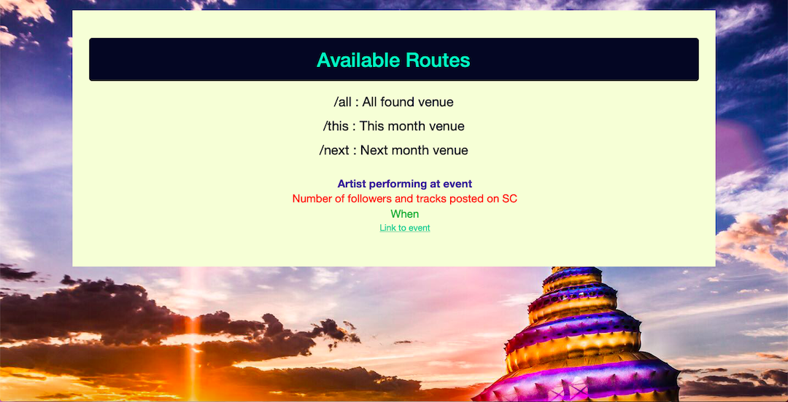
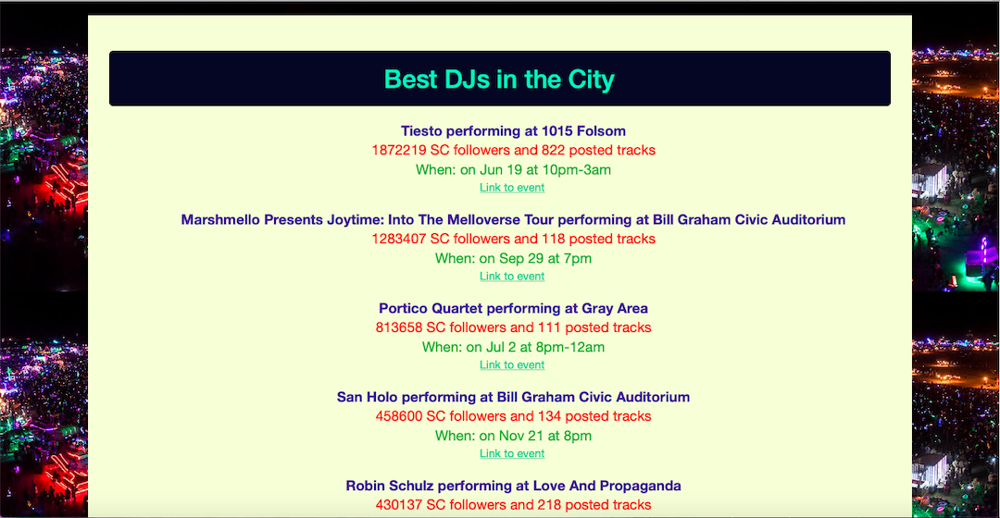
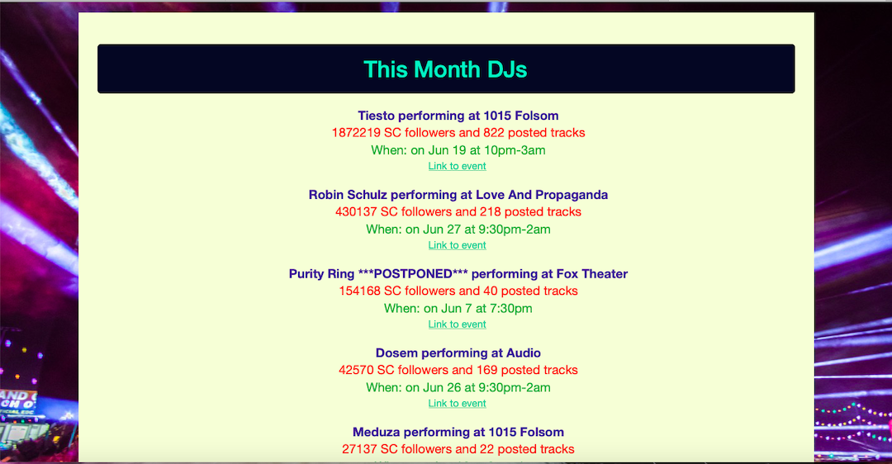
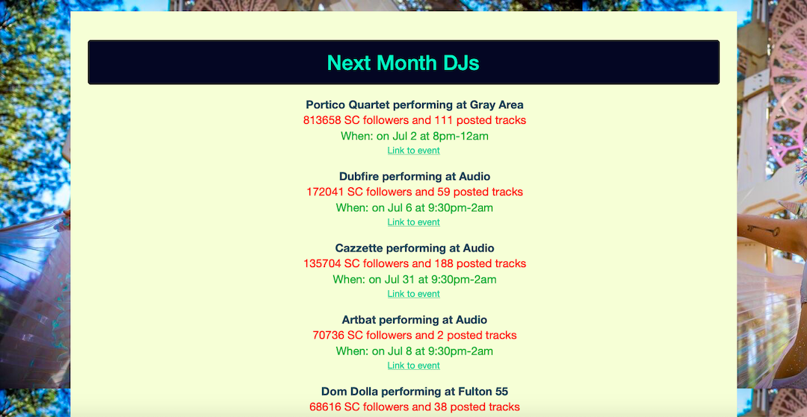
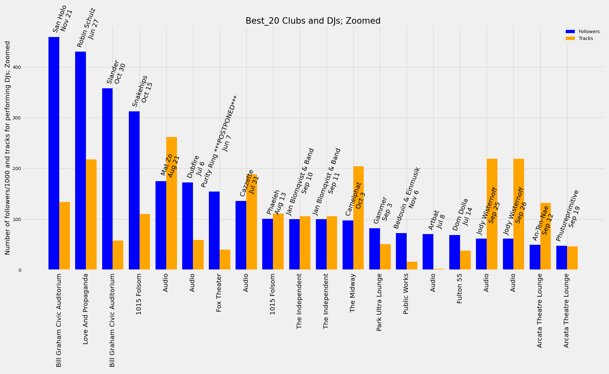

# House-Cloud

This work presents an app construction that is rating DJ artists of electronic music events in SF, then presents top venues where DJs with the highest rating are performing in overall found published venues.

Motivation:
There is a large community of electronic music (particularly house) funs in the city of SF; and there are hundreds of different clubs and events hosting best DJs from around the world every weekend. What club should you choose to have the best experience for your weekend? 
(Typically, house-music funs need to find what DJs are performing at each club, then locate them on SoundCloud.com and identify their rating (number of followers and albums released), which is a manual, long and tedious process, can take up to few hours of precious weekend time)). 
So that, it would be great to have a quick projection of events from an app flask server with the top clubs where DJs with the highest rating are performing. 

Example of the found venue, sorted, zoomed (when excluding first three,  most popular artists):

